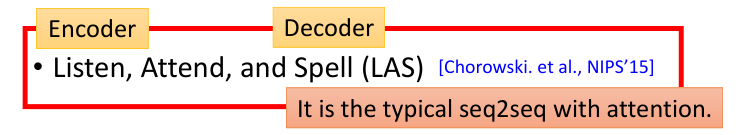
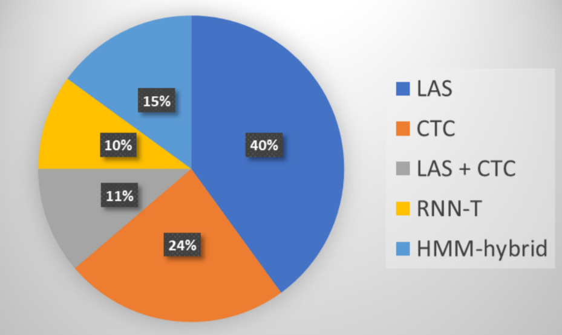
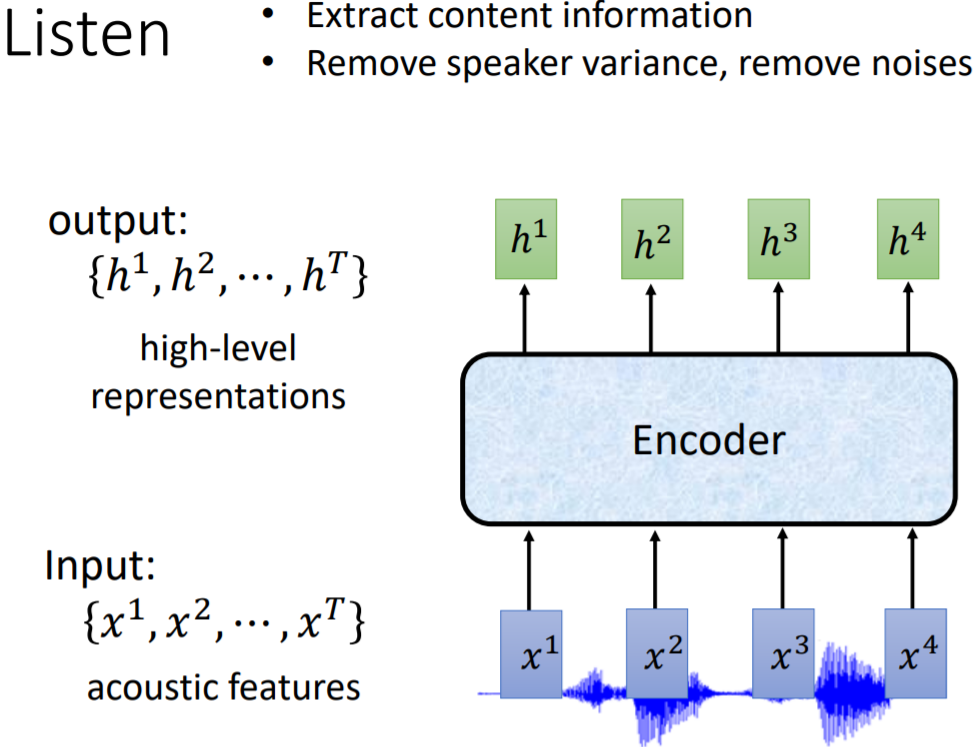
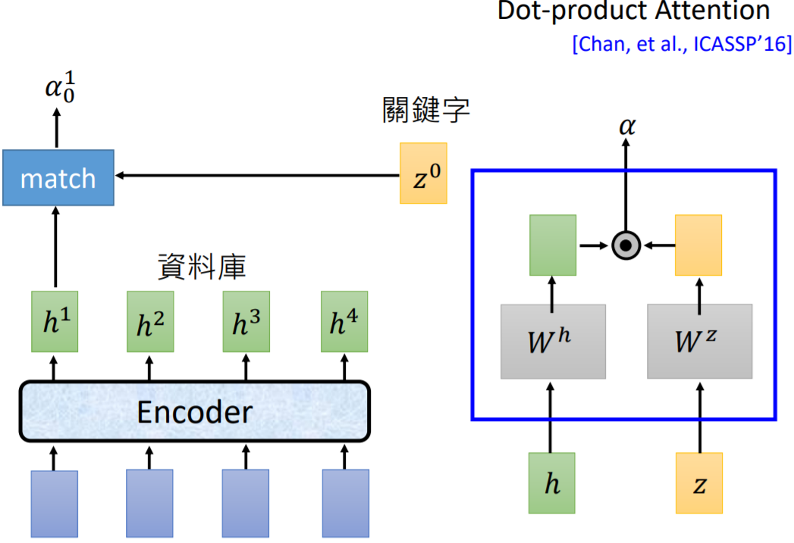

## 概论

声音被表示为向量，文字被表示为token序列

### token（符号）

常用token

**音位（phoneme）**，是[人类](https://baike.baidu.com/item/人类/31910)某一种[语言](https://baike.baidu.com/item/语言/72744)中能够区别[意义](https://baike.baidu.com/item/意义/2581536)的最小[语音](https://baike.baidu.com/item/语音/6140117)单位，是[音位学](https://baike.baidu.com/item/音位学/6930660)分析的基础[概念](https://baike.baidu.com/item/概念/829047)。每种语言都有一套自己的音位系统。

lexicon词汇、词典，可以将单词转化为音素，进而可以读出

这需要语言学基础

**Grapheme** 最小的书写单位，英文为单词，中文为单个的字。不需要**lexicon**

**Word**  在英文中为单词，在中文为词，中文比较难于辨识，缺少空格来分割

**Morpheme** 最小的有意义的单元

这里提一句，**tokenization**指的是**分词**

19年的使用趋势如下

## 常用算法

### LSA

**下采样**

### 目前在语音识别领域，有哪些常用的算法？

语音识别也和图像处理一样，有传统的语音识别算法和基于 DeepLearning 的语音识别算法。当然，现在的主流都是采用 Deep Learning 去做的。 那么，在传统语音识别领域，一般用什么方法呢？用得最多的就是 3 个算法，HMM（Hidden Markov Model） ；GMM（Gaussian Mixture Model）；CTC（Connectionist Temporal Classification）

基于 Deep Learning 的语音识别算法，依据模型的不同，有如下 5 种选择：

CTC 出现得最早，后来随着 Seq2Seq 概念的提出，有了 LAS 和 RNN-T，近些年慢慢发展出了 Neural Transducer，MochA。比较常用的是前面 3 个（LAS, CTC, RNN-T），LAS 是可以和 CTC 一起使用的。另外，传统的 HMM 模型也可以结合 DNN 模型，做一些融合。下图为 2019 年 NLP 顶会 100+paper，所采用的各种模型的比例

### LAS 算法

LAS 就是我们所熟知的那个 Seq2Seq 算法，只不过其用在了语音识别领域，称作 LAS

LAS 的全称为 Listen，Attend，Spell。分别对应于 Seq2Seq 模型的 Encoder，Attention 和 Decoder

#### Listen（Encoder）

对于输入的二维语音信号，可以采用如下三种方式来做 Encoder

- CNN（这里是 1 维卷积）
- RNN
- Self-Attention

有时候，在上述步骤处理完之后，我们也会适当加入 Down-Sampling 操作。因为一段声音讯号太长了，而且相邻向量间，带有重复的信息。为了节省计算量 ，我们可以用 Pyramid RNN，它的做法是在每一层的 RNN 输出后，都做一个聚合操作。把两个向量加起来，变成一个向量。这样它的隐层就会比较少。或者我们也可以用 Pooling Over time，两个 time step 的向量，只选其中一个，输入到下一层

除了上面两个，还有一些 Down-Sampling 的方法，例如 Time-delay DNN，通常 CNN 是计算一个窗口内每个元素的加权之和，而 TDDNN 则只计算第一个和最后一个元素；Truncated self-attention 是自注意力的一个变形。通常自注意力会对一个序列中每个元素都去注意，而 Truncated 的做法是只让当前元素去对周边一个窗口范围的元素注意

#### Attend（Attention）

Attention 机制就是使得每个时间步，用来解码的输入不一样，从而使得不同时间步关注的侧重点不一样

Attention 的输入包括三部分：

1. Query 向量（下图中的 h1,h2,h3,h4）
2. Key 向量（下图中的 z0）
3. Value 向量（下图中的 h1,h2,h3,h4）

通过 Query 和 Key 计算得到权重 Weight（下图中的 a0），然后将 Weight 进行归一化操作之后，与 Value 进行 dot product，最终得到解码器的输入

#### Spell（Decoder）

将得到的 c0 和之前的 z0 作为解码器 RNN 的输入，输入是 z1，z1 代表的是一个词表 V 中所有可能词预测概率分布向量。我们取 argmax 就可以解码得到最有可能的第一个 token。再拿 z1 与原编码器的隐层向量做 Attention，得到一个新的 context vector c1，它与 z1 一起输入到 RNN，同样的方式就能得到第二个 token。以此类推，直到解码器得到的 token 为终止符

### 语音识别是否非要用注意力不可呢？

注意力机制最早是用在 Seq2Seq 翻译上解决源语言与目标语言的对齐问题。这种跨度（指注意力观测的范围）很大的注意力，在语音上用会有种杀鸡焉用牛刀的感觉。因为语音上，每次注意跳跃是有限的。而不会出现像机器翻译那样，源句子的第一个词可能是目标句子的最后一个词。我们可以用 Location-aware attention 来优化。使得注意力不能够随便乱跳，而是要考虑前一个时间步得到的注意力权重影响。这样模型就能学到，每解码出一个 token，注意力就要往右移动一点

#### 

LAS 虽然神通广大，但它也有一些问题。我们期待我们的模型可以做 online 的识别，即能够一边听，一边做语音识别。而不是模型听完整句话后，等上一秒，模型才输出辨识结果

