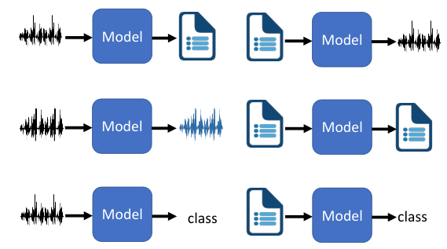
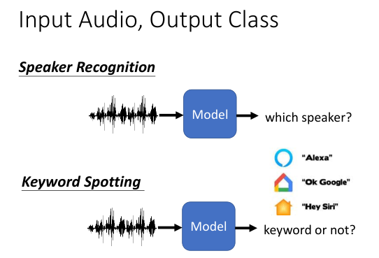

本课程的特点是注重**语言信号**，占比为0.5

NLP可以概括为以下的过程

分别对应于以下的过程

1. 语言识别 Speech recognition
2. Text to Speech synthesis
3. speech separation,    voice conversion,   unsupervised voice conversion(无监督语言转换)
4. 分类

5、文本生成、翻译、摘要、对话、问答

最后，深度学习在NLP领域已经占据垄断地位，主要的框架为BERT