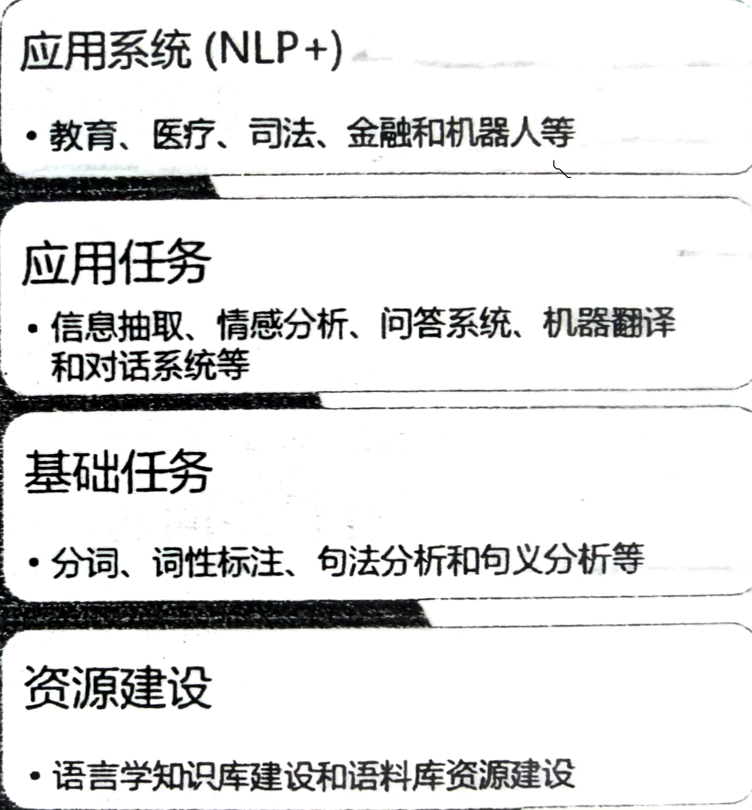

### NLP与人工智能的发展阶段

一般认为，AI的发展经历了一下阶段

- 运算智能——基础的运算与储存能力
- 感知智能——模式识别
- 认知智能——建模、推理等

目前的NLP处于第三个阶段

### NLP的困难性

语言的抽象，词的组合多样、歧义、词的演进、非规范性、主观性（这导致NLP的标注数据比CV的少得多）、知识性（理解语言所需的背景知识以及推理能力）、难以移植

### NLP的任务体系

### NLP的任务类别

主要可以分为5类

- 回归：将文本映射为连续的数值，例如作文打分
- 分类，判断文本所述的类别，例如垃圾邮件分类、情感分析
- 匹配问题，判断两个文本之间的关系
- 解析，词性标准，句法分析等
- 生成问题，机器翻译、文本摘要等

### NLP的研究对象

包括了语言的本身形式、语言的含义、语言的背景知识、语言的语境

### 预训练模型

首先在原任务是哪个预训练一个初始的模型，然后再目标任务上对模型进行精调，从而达到提高目标任务准确性的目的。这是迁移学习思想的一种应用。

由于NLP的标注数据小 ，不够深度学习用的，因此出现了迁移学习